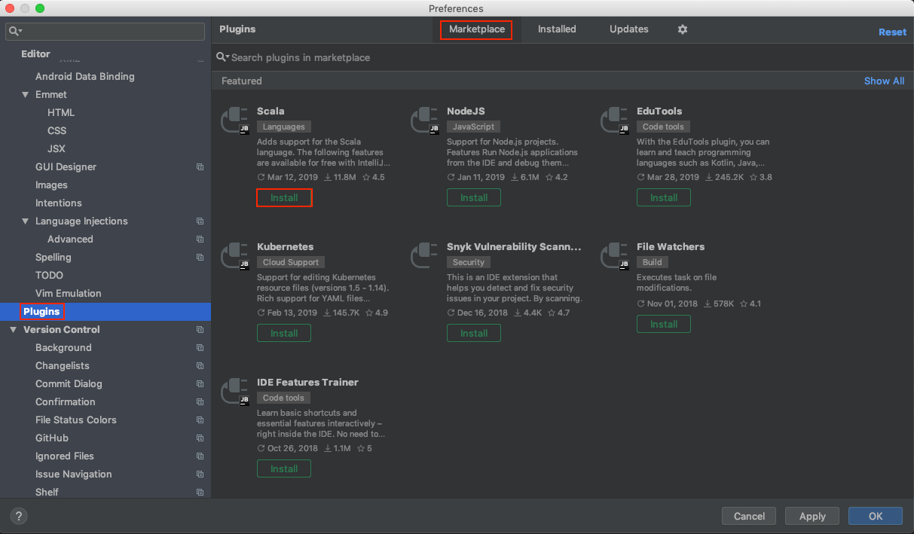

# 설치

### **스칼라를 사용하려면 자바를 먼저 설치해야 함**

아래와 2가지 설치법만 정리했으며, 그 외의 설치 방법은 [스칼라 다운로드](https://www.scala-lang.org/download/) 참고

* [Mac](#mac)
* [IntelliJ](#intellij)

## Mac

`Homebrew` 사용

```
$ brew update
$ brew install scala
```

------

## IntelliJ

Preferences > Plugins > Marketplace탭 또는 검색 후, Scala 설치


